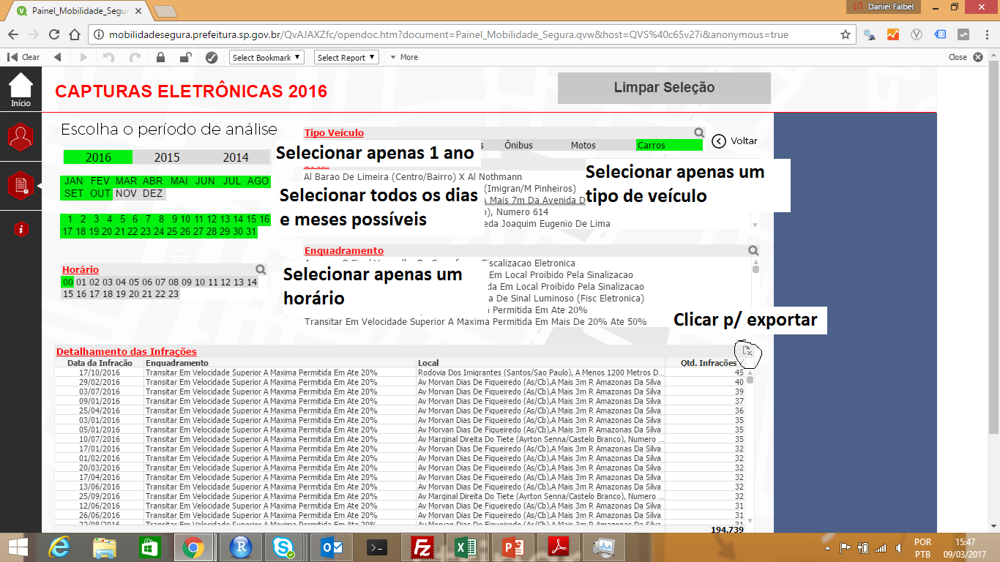

# spmultas

Banco de dados extraído manualmente do [Portal da Mobilidade](http://mobilidadesegura.prefeitura.sp.gov.br) Segura da Prefeitura
de São Paulo.

## Instalação

Você pode instalar o pacote usando:

```R
# install.packages("devtools")
devtools::install_github("dfalbel/spmultas")
```

## Exemplo

Esse pacote não possui funções e sim `data.frames`. A lista completa de 
`data.frames` disponíveis está abaixo. Para utilizá-los use `data(nome_do_df)`.

* carros_eletronicas

O nome das tabelas reflete os eu conteúdo da seguinte forma: tipoVeiculo_tipoCaptura. 
Por exemplo: carros_eletronicas indica que são as infrações cometidas por veículos
do tipo "Carro" e foram capturadas eletronicamente (Radar).

## Contribua

Não consegui fazer um scraper para o portal da prefeitura. O site ter sido feito com 
QlickView dificulta muito. 

Entretanto, não é tão demorado fazer o download manual das tabelas. Até agora, 
fiz apenas para os veículos do tipo "Carro", ams ainda falta fazer para utilitários,
ônibus, caminhões, motos e outros.

Abaixo, mostro como fiz o download manual dos dados. Se alguém quiser contribuir,
basta seguir estes passos.



Depois de exportar, salve os arquivos na pasta `data-raw` deste repositório.
A organização dela é bem intuitiva: `tipo do veiculo > tipo da captura > ano > horario.extensao`.


